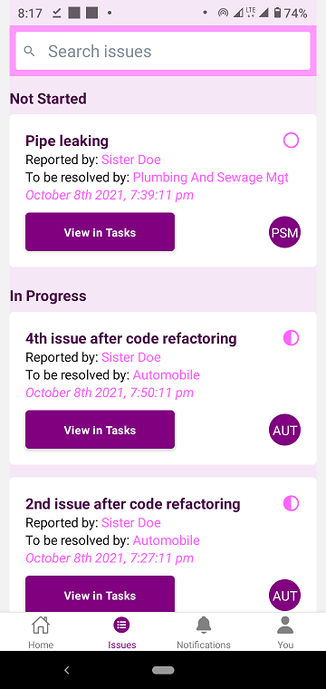
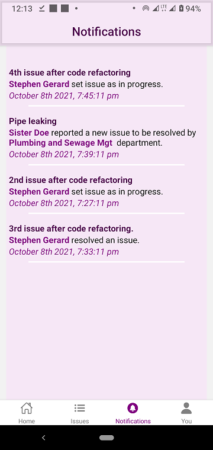
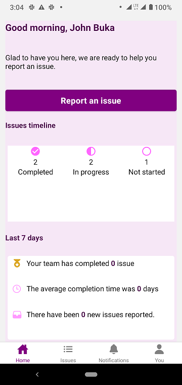

> #Issue-reporting App
This app was built personally to demonstrate my understanding of React-Native, Redux state management and Firestore.

##Purpose
This app was built to assist factory workers report issues/problems encountered during work. The department responsible for resolving such issues is tagged. Any person from that department can easily start working on the issue. Once work is started on the issue, it can be marked as in progress by using the Mark as in progress button in Task component. When the issue is completed resolved, it can be marked as completed by using the Mark as completed button also in Task component. A resolved issue can be deleted.

Some screenshots of the screens are below:
| SignUp screen  | Signin screen |
| ------------- | ------------- |
|   |   |

| IssuesList screen  | Notification screen |
| ------------- | ------------- |
|   |   |

| Homescreen screen  | UserInfo screen |
| ------------- | ------------- |
|   |   |

.
