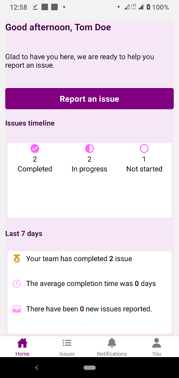
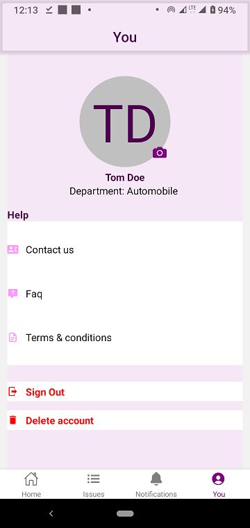

> # Issue-reporting App
This app was built using React-Native and Firestore, with Redux as the state manager.


## Purpose
This app was built to assist factory workers report issues/problems encountered during work. The department responsible for resolving such issues is tagged. Any person from that department can easily start working on the issue. Once work is started on the issue, it can be marked as in progress by using the Mark as in progress button in Task component. When the issue is completed resolved, it can be marked as completed by using the Mark as completed button also in Task component. A resolved issue can be deleted.


## Installation
The project uses Node.js and Expo CLI. If you do not have Node installed, you can download it here: [Node.js](https://nodejs.org/en/download/).
Then follow the [Expo](https://docs.expo.dev/) installation guides to configure your environment.

Once your environment is configured, navigate to the directory where you want to start the project and run the following commands
```
git clone https://github.com/ChinonsoIg/issue-reporting.git

npm install
```
The above commands will clone the project into your local machine and install all the dependencies.

Once the denependencies are installed, launch the app by running the command:

```
expo start
```
A new browser tab should open automatically displaying the Metro Bundler on port [http://localhost:19002](http://localhost:19002). You can choose to view the project on your browser by clicking "Run on browser". 

If you wish to view it on your phone, then you have to download Expo on Google PlayStore. Open it, and scan the QR Code displayed on the Metro Bundler page. The app will open on your mobile device. You can edit the work and Save, it will reload automatically.


## How to Use the App
Download the app and sign up. If the sign up is successful, you'll be redirected to homescreen.
When you encounter any issue you wish to report, click on the "Report an issue" button........to be continued.

Some screenshots of the screens are below:
| SignUp screen  | Signin screen |
| ------------- | ------------- |
|   |   |


| Homescreen screen  | UserInfo screen |
| ------------- | ------------- |
|   |   |


| IssuesList screen  | Notification screen |
| ------------- | ------------- |
|   |   |


